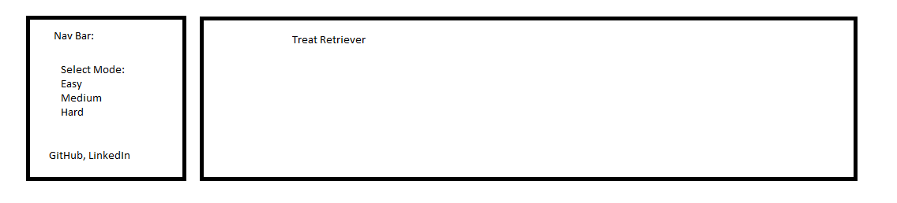

# Treat Retriever
## Background and Overview 
Treat Retriever is an infinite run obstacle avoiding and collection game inspired by similar games like Subway Surfers and Temple Run.
You are the caped super-retriever! Avoid angry vacuum cleaners and collect treats to get the highest score possible.
## Functionality and MVP
In Treat Retriever, users will be able to:
    -Use space bar to jump over obstacles (vacuum cleaners)
    -Collect treats increase their score
    -Choose between an easy, medium, or hard mode
Maybe Feature:
    -Cat popping up and out of sewer in which doggo has to avoid
## Wireframe 

## File Structure
``` 
    /assets
        -background.png
        -bone_treat.png
        -caped_hero.png
        -evil_vacuum.png
        -WireFrame.png
    /styles
        -index.scss
    /src
        -background.js
        -obstacles.js
        -treat.js
        -vacuum.js
        -treat_retriever.js
        -difficulty_levels.js
        -game.js
        -player.js (dog sprite)
        -nav_bar.js
        -index.js
        
```
## Architecture && API
    -CanvasHTML to render various sprites and obstacles
    -HTMLDom will be used for rendering various game inputs and 
    -Webpack to bundle Javascript, CSS files and provide scripts
## Implementation Timeline
Day 1-3:
1. Create Index.html based on Wireframe
2. Player Logic
3. Background and Game Logic
4. Treat & Obstacles & Score
5. Nav Bar & Difficulty levels
